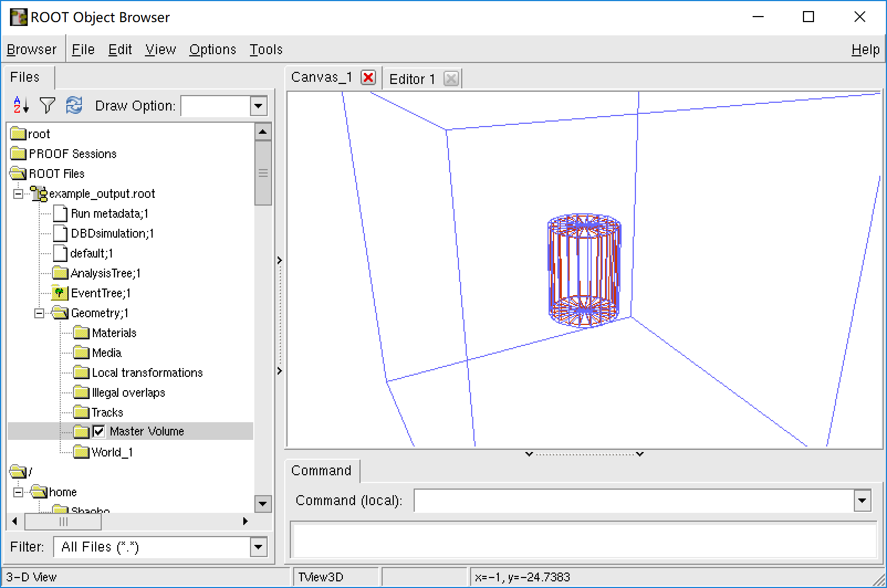

## REST Packages

REST provides extensible functionalities through so-called "packages". They are separate program based 
on REST mainbody and other softwares. They adds libraries and executables to REST installation, thus 
providing new functionalities.

### restG4

restG4 provides an executable named restG4 which refers to both REST and geant4 library. To install it, 
we must have Geant4 and REST mainbody installed. Then use commands `cmake` and `make`, as
instructed in section 2. restG4 is a single-executable program. By default it is installed in REST 
bin directory (${REST_PATH}/bin/). We can directly type `restG4` to start it.

Several example rml files will be added into REST example directory (${REST_PATH}/example/). To start 
our first geant4 simulation, we enter this directory and run restG4:

:~$ `cd $REST_PATH/example/restG4template`

:restG4template$ `restG4 restG4.rml`

Then a geant4 simulation will start for 100 events, generating a file "example_output.root". This root file 
contains a TTree with branch "TRestG4EventBranch", and a TGeoManager named "Geometry". We can view them 
in TBrowser.

With restG4, we can do a two-step simulation to test our detector response. First use restG4 to generate 
root file with raw event data. Then use REST build-in processes to convert this root file into signal 
event(readout waveform), which is very close to the data we get from real world detector. Then we can try
our analysis algorithm upon this simulation data. 

For example, we process the previous output file with the example rml:

:restG4template$ `restManager --c ../simDataAnalysis.rml --i example_output.root --o abc.root`

This gives us information of cut efficiency of track recognition.

### restDataBaseImpl

REST classes will try to access certain database through the interface class TRestDataBase. 
Such database accessibility is disabled when we install REST, since the interface lacks implementation.
We need to install this package before we can use database in REST.

The target database of this package is PostgreSQL. Initial code is from Chen Xun. 

There are two tables used by restDataBaseImpl:

table1(run table): **run_id**, **subrun_id**, type, usr, tag, description, version, run_start, run_end

table1(file table): **run_id**, **subrun_id**, **file_id**, file_name, file_size, start_time, stop_time, event_rate, sha1sum, quality

The bold items are primary keys, which means their combination should be unique in each tables.

A so called "run" in REST can either be a data taking run or a simulation run. Its id is unique and
is specified in column "run_id". Based on this run, multiple analysis could be commenced. Their id 
are also unique and are specified in column "subrun_id". subrun_id is 0 for data taking run and 
simulation run. run_id is 0 for analysis run when input file is not recorded in database. 

To install this package, first switch to root directory of this package. Then use commands `cmake` 
and `make`, as instructed in section 2. The compiled library libRestDataBaseImpl.so will be installed to 
$REST_PATH/lib. After loading the libraries in this folder, TClass will be able to instantiate objects
for the classes in it. We usually do this at the begning of the main executable:

`int main( int argc, char *argv[] ){`  
`TRestTools::LoadRESTLibrary(true);`  
`...`  
`}`  

Then, to instantiate the database class safely, we recommend using our provided generator method:

`TRestDataBase* db = TRestDataBase::instantiate();`  
`if(db!=NULL){`  
`// Your database operation`  
`}`  

The followings are its usage:

`// 1. start a new run and add files in it`  
`int runId = db->newrun();`  
`db->new_runfile("abc.graw");`  

`// 2. append files in an existing run`    
`int runId = db->getlastrun();`  
`db->set_runnumber(runId);`  
`db->new_runfile("abc.root");`   

`// 3. view the run info`   
`int runId = db->getlastrun();`  
`db->print(runId);`  

`// 4. execute custom sql command`  
`db->exec("select * into rest_files_bk from rest_files");`  
`db->exec("select * from rest_runs where run_id > 980");`  

[**prev**](8-start-your-own-analysis-with-rest.md)
[**contents**](0-contents.md)
[**next**](appendix.md)